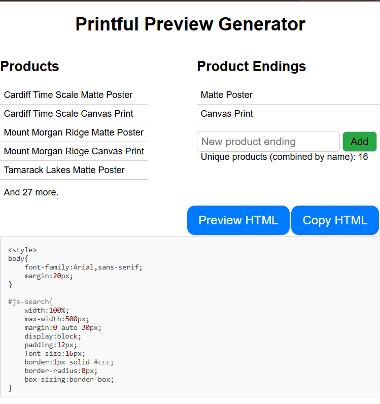
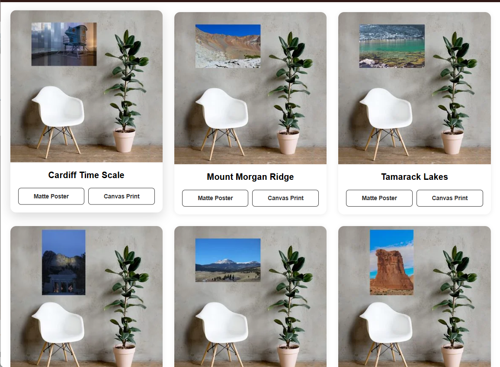

# Printful preview maker
## Generate custom HTML listings for your printful Quick Site

This Chrome Extension pulls product listings from a Printful Quick Site and compiles them into an embeddable HTML snippet

## Installation

1. Download the [latest release](https://github.com/jdszekeres/printful_preview_generator/releases)
2. Unzip the folder
3. visit [chrome://extensions](chrome://extensions)
4. Enable **Developer Mode** in the top right corner
5. Select **Load Unpacked** and select the folder you unzipped
6. Use on any Printful.me Quick Shop :tada:

## Usage
https://github.com/user-attachments/assets/aa7c26c4-67d4-4925-9da8-34a3a6c0ecb0

When on any printful store (`*.printful.me`), open the browser popup to generate the embed snippet

Try on [jackson-szekeres-photo.printful.me](https://jackson-szekeres-photo.printful.me/) if you don't have your own printful site.

## Screenshots

| Popup Page | Preview Page |
| :---:     | :---:    |
|      |    |

## Permissions
Printful Preview Generator uses the following permissions:
- Active Tab: Accesses the active tab to pull data from the Prinful site
- Scripting: To execute the script that pulls data from the Prinful site
- Storage: To send the pulled data from the Printful site to the extension
